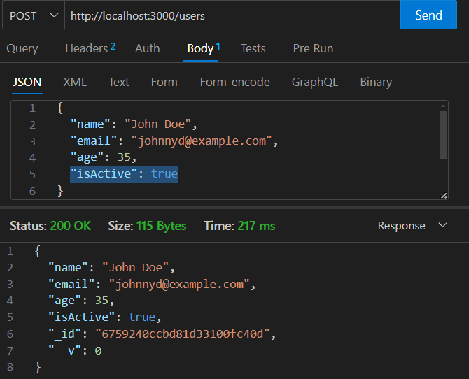
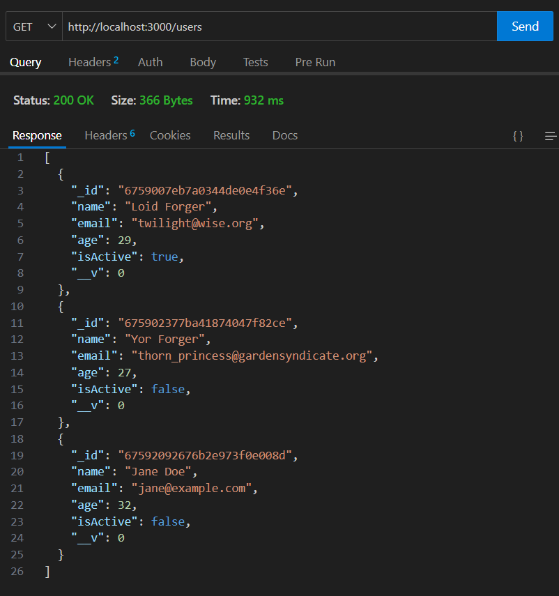
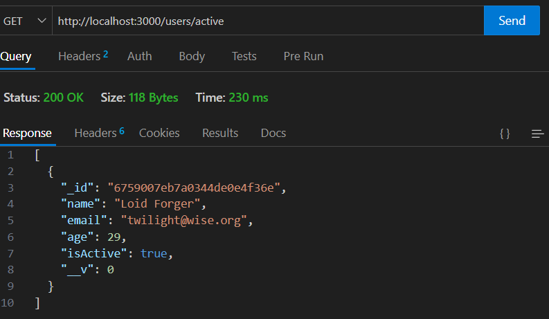
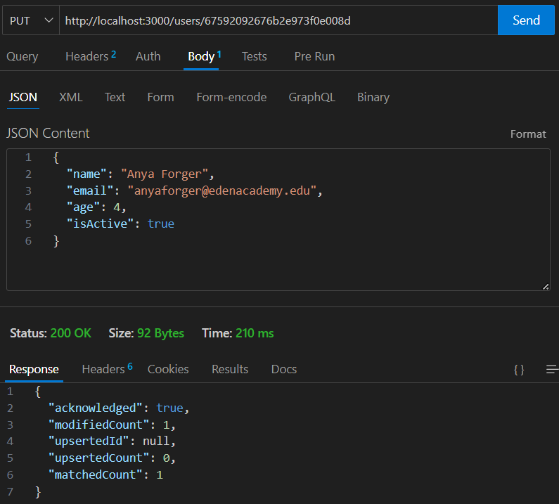
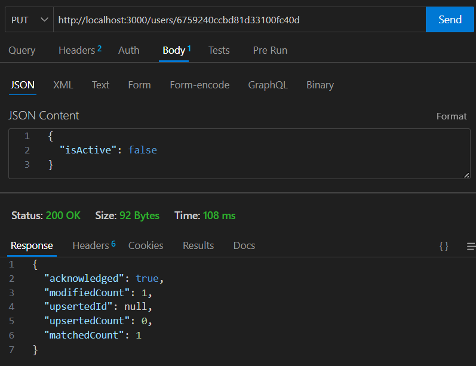
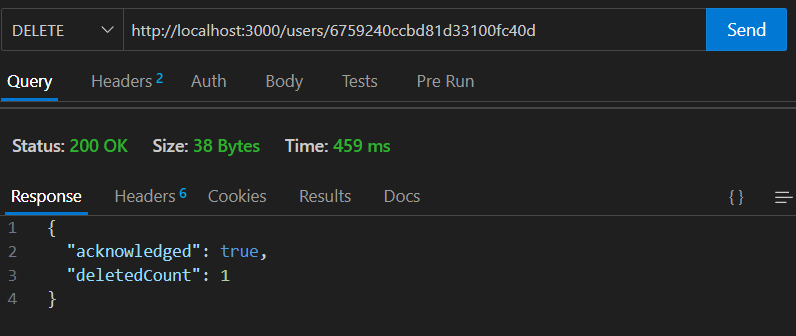

# Express MongoDB Advanced

## Project Overview

This project focuses on creating a RESTful API with Express and MongoDB using Mongoose. It covers:

- Setting up a basic Express server with MongoDB integration.
- Using environment variables to manage sensitive data.
- Defining a user schema and model.
- Implementing CRUD (Create, Read, Update, Delete) operations.
- Testing API endpoints using Thunder Client.
- Learning concepts like route parameters and differences between Mongoose and MongoDB methods.

## Project Setup

### Requirements

1. Node.js installed on your system.
2. MongoDB instance (local or cloud-based like MongoDB Atlas).
3. Thunder Client or Postman for API testing.

### Installation Steps

1. **Create a GitHub repository**:

   - Initialize the repository with a README and set `.gitignore` to Node.
   - Clone the repository to your local machine.

2. **Initialize a Node.js project**:

   ```bash
   npm init -y
   ```

3. **Install dependencies**:

   ```bash
   npm install express mongoose dotenv
   ```

4. **Set up Nodemon for development**:

   ```bash
   npm install --save-dev nodemon
   ```

   Update `package.json` to include a dev script:

   ```json
   "scripts": {
     "test": "node index.js",
     "dev": "nodemon index.js"
   }
   ```

5. **Setup project structure**:

   ```
   project-root/
   |-- models/
   |   |-- users.js
   |-- .env
   |-- index.js
   ```

6. **Environment Variables (.env)**:
   Add the following to the `.env` file:
   ```
   MONGO_URL=your_mongodb_connection_string
   ```

## Creating a Basic Express Server with Mongoose

**index.js**:

```javascript
const express = require("express");
const mongoose = require("mongoose");
const User = require("./models/users");
const app = express();
const port = 3000;

require("dotenv").config();
const mongoUrl = process.env.MONGO_URL;

// Middleware to parse JSON bodies
app.use(express.json());

// Connect to MongoDB
mongoose
  .connect(mongoUrl, {
    useNewUrlParser: true,
    useUnifiedTopology: true,
  })
  .then(() => {
    console.log("Connected to MongoDB");
  })
  .catch((error) => {
    console.error("Error connecting to MongoDB:", error);
  });

app.get("/", (req, res) => {
  res.send("Hello, World!");
});

app.listen(port, () => {
  console.log(`Server is running at http://localhost:${port}`);
});
```

## Defining a Schema and Model

**models/users.js**:

```javascript
const mongoose = require("mongoose");

const userSchema = mongoose.Schema({
  name: { type: String },
  email: { type: String },
  age: { type: Number },
  isActive: { type: Boolean },
});

const User = mongoose.model("User", userSchema);

module.exports = User;
```

## Creating and Reading Users

### Create a New User (POST /users)

```javascript
app.post("/users", async (req, res) => {
  const data = req.body;

  const newUser = new User({
    name: data.name,
    email: data.email,
    age: data.age,
    isActive: data.isActive,
  });

  const savedUser = await newUser.save();
  res.json(savedUser);
});
```

### Get All Users (GET /users)

```javascript
app.get("/users", async (req, res) => {
  const users = await User.find();
  res.json(users);
});
```

### Get Active Users (GET /users/active)

```javascript
app.get("/users/active", async (req, res) => {
  const activeUsers = await User.find({ isActive: true });
  res.json(activeUsers);
});
```

### Testing Create and Read Operations with Thunder Client

**Screenshots:**

1. Creating a new user (POST /users)  
   

2. Retrieving all users (GET /users)  
   
3. Retrieving only active users (GET /users/active)  
   

## Updating and Deleting Users

### Update a User (PUT /users/:id)

```javascript
app.put("/users/:id", async (req, res) => {
  const userId = req.params.id;
  const update = req.body;

  const result = await User.updateOne(
    { _id: userId },
    { $set: update },
    { runValidators: true }
  );

  res.json(result);
});
```

### Deactivate a User (PUT /users/:id/deactivate)

```javascript
app.put("/users/:id/deactivate", async (req, res) => {
  const userId = req.params.id;

  const deactivated = await User.updateOne(
    { _id: userId },
    { $set: { isActive: false } },
    { runValidators: true }
  );

  res.json(deactivated);
});
```

### Delete a User (DELETE /users/:id)

```javascript
app.delete("/users/:id", async (req, res) => {
  const userId = req.params.id;

  const deleted = await User.deleteOne({ _id: userId });

  res.json(deleted);
});
```

### Testing Update and Delete Operations with Thunder Client

**Screenshots:**

1. Updating a user (PUT /users/:id)
   

2. Deactivating a user (PUT /users/:id/deactivate)  
   
3. Deleting a user (DELETE /users/:id)  
   

## Things I’ve Learned

### PUT vs PATCH

- **PUT**: Replaces the entire resource with the provided data.
- **PATCH**: Partially updates the resource with only the provided fields.

### Express Params (`:id`)

- Route parameters (e.g., `:id`) are placeholders in the route path.
- **How it works**:
  - For a route like `/users/:id`, `:id` is dynamically replaced by the actual value in the request.
  - Example: A request to `/users/123` makes `req.params.id` equal to `123`.
- Allows for building flexible and dynamic routes.
- Use `req.params` to access these values in the handler.

### `findByIdAndUpdate` vs `updateOne`

- **`findByIdAndUpdate`**:
  - Specifically for updating documents by `_id`.
  - Returns the updated document by default.
- **`updateOne`**:
  - Updates the first document that matches the filter.
  - Does not return the updated document; only provides a result object.

`updateOne` was used in this project for more flexibility in filter conditions.
